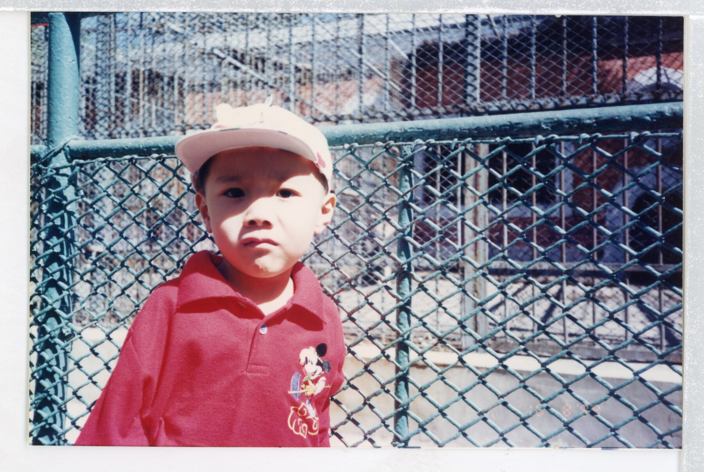

# PhotoCut

PhotoCut 用来批量裁剪扫描照片：自动检测照片四角，在本机浏览器中确认或调整，然后完成透视校正和裁剪。所有照片都只在本机处理。

## 为什么做 PhotoCut

家里保存着很多老照片是当年由底片扩印成 5 寸或 6 寸的实体照片。为了将它们数字化保存，我会用扫描仪逐张扫描，但得到的图像往往带有扫描仪背景板形成的白边；有些照片本身也保留着扩印时的白色边框。扫描仪自带、市面上现有的修正功能通常仅适用文档，照片使用时会被裁剪掉非常多的边界画面。而自己逐张手工寻找边界、校正透视并裁剪，不仅费时，也很难保持一致。

PhotoCut 是为了解决这个问题而制作的。它会自动识别并标记照片的四个角点，再由用户通过本机界面逐张确认；如果识别结果不够准确，也可以手动调整。全部确认后，程序会统一进行透视校正和裁剪，并批量输出处理后的照片。

请注意，由于本程序是基于扫描仪的工作流创造的，因此当照片本身不平整、有反光，本程序目前无法解决类似问题。

未来计划加入校色功能，让老照片的扫描整理、边界确认、裁剪和色彩调整可以在同一个流程中完成。

## 效果示例

左侧是扫描得到的原始图像，右侧是 PhotoCut 完成透视校正和裁剪后的输出。

<table>
  <tr>
    <th>扫描原图</th>
    <th>PhotoCut 输出</th>
  </tr>
  <tr>
    <td></td>
    <td></td>
  </tr>
  <tr>
    <td></td>
    <td></td>
  </tr>
</table>

## 安装

需要 Python 3.10 或更高版本，支持 macOS、Windows 和 Linux。

```bash
git clone https://github.com/LittleSixNine/photocut.git
cd photocut
python3 -m venv .venv
source .venv/bin/activate        # Windows：.venv\Scripts\activate
python3 -m pip install -e .
```

仓库已经包含可以再分发的 V8.2 ONNX 模型，不需要另外下载模型，默认的 PhotoCut Selector v4 可以直接运行。

## 使用

将下面的 `input` 换成你的照片文件夹，依次执行三个步骤：

```bash
# 1. 检测四角
photocut input --detect

# 2. 在本机浏览器中确认或调整
photocut input --confirm

# 3. 透视校正并裁剪
photocut input --crop
```

默认输出到输入文件夹旁边的 `<文件夹名>裁剪/`。裁剪时会向内缩进 50 个原图像素以去除扫描白边，源照片不会被修改。

默认场景是一张放在白色扫描仪底面上的实体照片。其他单照片背景可使用：

```bash
photocut input --scene-profile generic_single --detect
```

也可以继续使用兼容入口 `python3 photocut_cli.py ...`。

## 版本

- PhotoCut Selector v4：默认选择和编排逻辑；历史记录中的机器标识仍为 `auto-v4`
- V8.2：默认白色扫描底检测器
- V7.1：候选生成和安全回退
- v5.2：兼容检测器
- GUI 2.0：默认的本机浏览器确认界面

## 测试

```bash
python3 -m pip install -e ".[dev]"
python3 -m pytest -q
python3 scripts/check_public_tree.py
```

## 许可

PhotoCut 源码和随项目提供的 V8.2 模型使用 MIT License。模型使用了由 TorchVision 权重初始化的 MobileNetV3 backbone，随模型保留了 BSD-3-Clause 上游声明。
